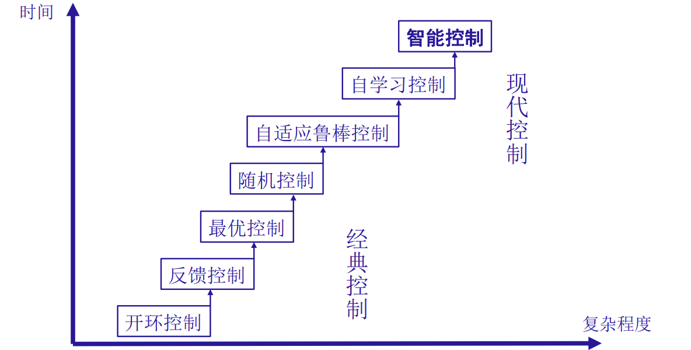

## 1.0 概论（导入）
世界第一台通用计算机：**ENIAC**

计算机的五代发展：

计算机之父：**冯·诺依曼**

冯·诺依曼型计算机硬件结构

人工智能
eg. 深蓝（Deep Blue）【国际象棋】、阿尔法（AlphaGo）【围棋】

人工智能之父：**艾伦·麦席森·图灵**（Alan Mathison Turing, 1912~1954）

**图灵测试**：指测试者与被测试者（一个人和一台机器）隔开的情况下，通过一些装置（如键盘）向被测试者随意提问。进行多次测试后，如果机器让平均每个参与者做出超过30%的误判，那么这台机器就通过了测试，并被认为具有人类智能。

**机器和人的差别**：机器回答问题是从原始的知识库里调取知识然后进行回答。但是人除了回答问题以外，还会因为环境影响伴随有情绪化内容。

**旅行商问题**（Travel Salesman Problem, TSP）：某旅行商从若干个城市的某城市出发去其他城市，每个城市只去一次，最后回到原来的城市，要求选择出其中的最短路径。【**枚举：N!**】

**逻辑推理的局限**：
> 100℃的水是热水。比热水低0.0001℃的水仍是热水。
> 结论：所有温度的水都是热水。

> “合”的反义词是“离”。“同”的反义词是“异”。
> 结论：“合同”的反义词是“离异”。

## 1.1 自动控制理论的发展历程

传统模型描述局限性
- 非线性系统
- 时变系统
- 非确定系统
- 不完全系统
- 缺陷系统
- 隐藏危险的系统

## 1.2 智能控制的概况

### 1.2.1 发展简况

#### 1. 智能控制的诞生
- 1966年，J. M. Mendal首先将人工智能技术应用于飞船系统的设计。
- 1971年，傅京逊首次提出智能控制概念，并归纳了三种类型的智能系统：
  - ① 人作为控制器的控制系统；
  - ② 人机结合作为控制器的控制系统；
  - ③ 无人参与的自主控制系统。
- 1985年，美国电气与电子工程师协会（IEEE）在纽约召开了第一届智能控制学术讨论会；
- 1987年，在美国举行了第一次国际智能控制大会，智能控制领域形成。

#### 2. 智能控制的三元论
$IC = AC \cap AI \cap OR$

式中各子集的含义为
- IC——智能控制（Intelligent Control）
- AI——人工智能（Artificial Intelligence）
- AC——自动控制（Automatic Control）
- OR——运筹学（Operational Research）

#### 3. 智能控制的特点
1. 学习功能
2. 适应功能
3. 自组织功能
4. 优化功能

### 1.2.2 几个重要分支
1. 专家系统（Expert System）：专家知识体系转换为计算机语言，使得机器代替人解决问题。
2. 模糊控制（Fuzzy Control）：以模糊集合和模糊逻辑推理为基础，将自然语言和思维的模糊性数学化再进行处理。
3. 神经网络控制（Neural Networks Control）：仿照人脑生理结构和神经网络以完成特征提取、非线性函数的映射等任务。

## 1.3 模糊控制
模糊系统：“模糊”是表示技术特征的词语，用来指明系统所使用的技术，并不是说系统本身是不精确描述的。模糊系统是一种基于知识或规则的系统，核心是“IF-THEN规则”所组成的知识库。

### 1.3.1 解决的问题
无法建立起清晰的数学模型的复杂的控制系统的控制

### 1.3.2 发展简史
- 形成期（1974年以前）
- 发展期（1974 ~ 1979年）
- 高性能模糊控制阶段（1979年至今）
- 模糊系统的权威期刊：IEEE Transactions on Fuzzy Systems (TFS)。JCR分区：SCI一区期刊

### 1.3.3 模糊控制的特点
- 设计不依赖于被控对象的精确数学模型
- 易于被操作人员接受
- 便于计算机软件实现
- 鲁棒性和适应性好
