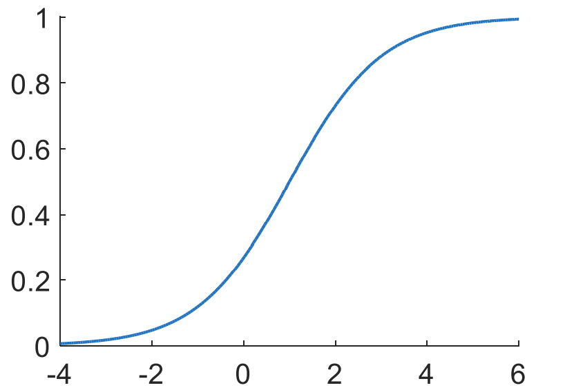
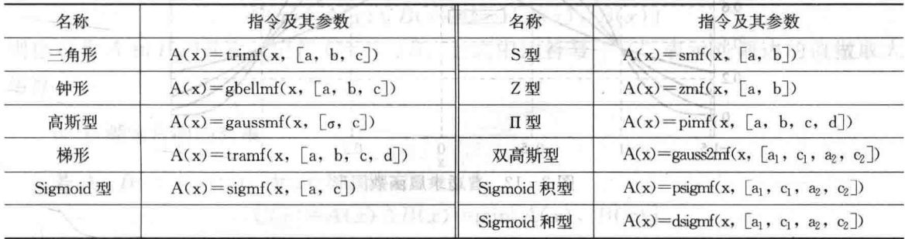

## 2.0 发展历史
排中律 → 三值逻辑（20世纪初，波兰逻辑学家卢卡西维茨（Lukasiewicz）） → 模糊集合（Fuzzy Set）和隶属度函数（Membership Function）（20世纪60年代，扎德（Zadeh））

## 2.1 模糊集合

### 2.1.1 经典集合（三类数学模型）
1. 确定性数学模型
   - 描述具有清晰的确定性、归属界线分明、相互间关系明确的事物。
   - eg. 数学分析、微分方程、矩阵分析。
2. 随机性数学模型
   - 描述具有或然性或随机性的事物，这类事物本身是确定的，但是它的发生与否却不是确定的。
   - eg. 概率论、随机过程
3. 模糊性数学模型
   - 描述含义不清晰、概念界线不分明的事物，它的外延不分明，在概念的归属上不明确。
   - eg. 模糊数学、模糊逻辑

#### 1. 经典集合简介
- 论域：要考虑和研究的事物（对象）全体，所讨论事物的特定限定范围。
- 元素：论域中的每个成员。
- 集合：具有同一本质属性的、确定的、彼此可以区别的全体元素总和，构成一个确定的整体。
- 集合（子集）：由论域中的部分元素构成。
- 概念的内涵：概念的本质属性
- 概念的外延：符合某一本质属性的全体对象的总和。
- 经典集合由映射 $C_A: U \to \{0 ,1\}$ 唯一确定。
- 特征函数 $C_A (x)$ ：用来描述元素x与集合A之间的关系，表示元素x属于集合A的程度。对于经典集合A，$x \in A \to C_A (x) = 1, x \notin A \to C_A (x) = 0$

#### 2. 经典集合的运
1. 子集与包含： $(\forall x \in A)(x \in B) \Leftrightarrow B \supset A, A \subset B$
2. 集合的相等： $A \subset B \wedge B \subset A \Leftrightarrow A = B$
3. 并集（逻辑和）： $(\forall x \in C)(x \in A \vee x \in B) \Leftrightarrow C = A \cup B$
4. 交集（逻辑积）： $(\forall x \in C)(x \in A \wedge x \in B) \Leftrightarrow C = A \cap B$
5. 差集（逻辑差）： $(\forall x \in B)(x \in A \wedge x \notin D) \Leftrightarrow B = A - D$
   - 补集： $B = U - A = A^C = \tilde{A}$ （特殊的差集）
6. 空集，全集 $\varnothing U$
7. 幂集 $\varphi (A)$ ：A的所有子集构成的集合

#### 3. 经典集合运算的性质
1. 分配律 $A \cap (B \cup C) = (A \cap B) \cup (A \cap C) ; A \cup (B \cap C) = (A \cup B) \cap (A \cup C)$
2. 结合律 $(A \cap B) \cap C = A \cap (B \cap C) ; (A \cup B) \cup C = A \cup (B \cup C)$
3. 交换律 $A \cup B = B \cup A ; A \cap B = B \cap A$
4. 吸收律 $(A \cap B) \cup A = A ; (A \cup B) \cap A = A$
5. 幂等律 $A \cup A = A ; A \cap A = A$
6. 同一律 $A \cup U = U ; A \cap U = A 2; A \cup \varnothing=A ; A \cap \varnothing = \varnothing$
7. 对偶律 $\overline{A \cup B} = \bar{A} \cap \bar{B} ; \overline{A \cap B} = \bar{A} \cup \bar{B}$
8. 双重否定律 $\overline{\bar{A}} = \left(A^{C}\right)^{C} = A$
9. 互补律 $A \cup A^{C}=A \cup \bar{A}=U ; A \cap A^{C}=A \cap \bar{A}=\varnothing$

### 2.1.2 模糊集合

#### 1. 基本概念
在模糊集合涉及的数值范围——论域U上，给定了一个映射：
$\tilde{A}: U \to [0, 1], x \mapsto \mu_{\tilde{A}}(x)$
则称集合 $\tilde{A}$ 为论域U上的模糊集合或模糊子集；
用 $\mu_{\tilde{A}}(x)$ 表示U中各个元素属于集合 $\tilde{A}$ 的程度，称为元素x属于模糊集合 $\tilde{A}$ 的隶属函数。
当x是一个确定的元素 $x_0$ 时，称 $\mu_{\tilde{A}}(x_0)$ 为元素 $x_0$ 对模糊集合 $\tilde{A}$ 的隶属度。

> 模糊集合可简记为F(uzzy)集合，隶属函数 $\mu_{\tilde{A}}(x)$ 简记为 $A(x)$

U上F集合的幂集 $\mathcal{F}(U)$: 论域U上的F集合全体。$\mathcal{F}(U) = \{A|A: U \to [0, 1]\}$

> 幂集 $\mathcal{F}(U)$ 是个经典集合，每个元素（F集合）是确定的。

#### 2. 模糊数
1、F集合的支集，核和正规F集：
设 $A \in \mathcal{F}(U)$，记集合
- $Supp A = \{x|x \in U, A(x) > 0\}$ 为F集合A的支集（supporter）
- $Ker A = \{x|x \in U, A(x) = 1\}$ 为F集合A的核（kernel）

把 $Ker A \neq \emptyset$ 的F集合成为正规F集合。

2、数 $\lambda$ 与集合A的数积：
设 $A \in \mathcal{F}(U), \lambda \in [0, 1], x \in U$. 定义集合 $\lambda A$ 满足 $(\lambda A)(x) = \lambda \wedge A(x)$
称 $\lambda A$ 为 $\lambda$ 与集合A的数积。【削头】

3、凸F集：
- 凸集：$A \in \phi(U)$，任意两点 $x_1, x_2 \in A$ 及 $\forall \lambda \in [0, 1]$，连接 $x_1$ 和 $x_3$ 线段上的点， $x_2 = \lambda x_1 + (1 - \lambda) x_3$ 都在A中，即 $x_2 \in A$.
- 凸F集：设集合 $A \in \phi(R)$，R是实数域，若 $\forall x_{1}, x_{2}, x_{3} \in R$，且 $x_{1} > x_{2} > x_{3}$，均有 $A(x_{2}) \ge \min \{A(x_{1}), A(x_{3})\} = A(x_{1}) \wedge A(x_{3})$，则称 A 是凸F集，否则是非凸的。

> 凸F集的隶属函数曲线形状应该是凸的、单峰的。
> 若 $A(x_{2}) > \min \{A(x_{1}), A(x_{3})\}$ ：严格凸集

4、F数：实数域上正规的、凸F集，称为正规实模糊数，简称模糊数，即把以某个实数值为核的凸F集称为F数。

> 隶属度函数单峰且峰值为1

#### 3. 表示方法
1、序对法
$$
\begin{aligned}
  A &=\left\{\left(x_{i}, A\left(x_{i}\right)\right) \mid x_{i} \in U, i=1,2, \cdots, n\right\} \\
    &=\left\{\left(x_{1}, A\left(x_{1}\right)\right),\left(x_{2}, A\left(x_{2}\right)\right), \cdots,\left(x_{n}, A\left(x_{n}\right)\right)\right\}
\end{aligned}
$$

2、扎德法
- 有限集或可数集
  $\begin{aligned}
    A &=\sum \frac{A\left(x_{i}\right)}{x_{i}} \\
      &=\frac{A\left(x_{1}\right)}{x_{1}}+\frac{A\left(x_{2}\right)}{x_{2}}+\cdots+\frac{A\left(x_{n}\right)}{x_{n}}, \quad i=1,2, \cdots, n
    \end{aligned}$
- 无限不可数集 $A = \int \frac{A(x)}{x}$

注：
- 此处的累加号“$\sum$”、加号“+”及积分号“$\int$”，并不表示累加、求和及积分，而是表示在论域上构成F集合的全体元素x与其隶属度A(x)间对应关系的总括；
- 分数线不表示除法运算，只表示某个元素 $x_i$ 与其隶属度 $A(x_i)$ 的对应关系。
- 隶属度(分子)为零的项可以省去，（自己写时尽量不要省，题目省略记得补出）。

3、向量法（有限有序集）
$A=\left(A\left(x_{1}\right), A\left(x_{2}\right), \cdots, A\left(x_{n}\right)\right)$

> 隶属度(分子)为零的项不可省略

4、函数法（无限不可数集）
隶属度函数 $A(x)$

## 2.2 隶属函数

### 2.2.1 确定隶属函数方法
1. 模糊统计法
2. 二元对比排序法
3. 专家经验法
4. 神经网络法

### 2.2.2 常用隶属函数

#### 1. 三角形
$$
f(x, a, b, c)=\left\{\begin{array}{ll}
0 & x \leqslant a \\
\frac{x-a}{b-a} & a \leqslant x \leqslant b \\
\frac{c-x}{c-b} & b \leqslant x \leqslant c \\
0 & x \geqslant c
\end{array}\right.
$$
要求 $a \le b \le c$。

#### 2. 钟形
是反比例函数的拓展，参数c决定了函数中心的位置，a和b决定了函数的形状。
$$
f(x, a, b, c)=\frac{1}{1+\left|\frac{x-c}{a}\right|^{2 b}}
$$

#### 3. 高斯型
是基于正态分布的原理而设计的，其中c（期望）决定曲线中心，σ（标准差）决定了曲线的宽度。
$$
f(x, \sigma, c)=e^{-\frac{(x-c)^{2}}{2 \sigma^{2}}}
$$

#### 4. 梯形
是对三角形函数的补充，即中部有一段隶属度为1的区域。
$$f(x, a, b, c, d)=\left\{\begin{array}{ll}
0 & x \leqslant a \\
\frac{x-a}{b-a} & a \leqslant x \leqslant b \\
1 & b \leqslant x \leqslant c \\
\frac{d-x}{d-c} & c \leqslant x \leqslant d \\
0 & x \geqslant d
\end{array}\right.
$$

#### 5. Sigmoid型
是一种特殊的函数，类似于“S”的形态。其中a调节函数形状，c决定函数中心位置。图像关于 (a, 0.5) 中心对称。
$$
f(x, a, c)=\frac{1}{1+e^{-a(x-c)}}
$$

### 2.2.3 MATLAB中提供的常用隶属函数指令及参数

注：
- MATLAB脚本文件名不能出现中文，且不能以数字开头。
- 如果有子函数，则子函数文件名要和子函数名称本身一样。
- 默认数值均为IEEE754标准64位浮点双精度类型。

> $u = x(A~=0)$ 从x中挑出使A不为0的项：支集
> $v = x(A==1)$ 从x中挑出使A为1的项：核

> 一种消除误差的方法： `A = double(uint16(1000 * A)) / 1000`

## 2.3 模糊集合的运算

### 2.3.1 模糊集合的基本运算

#### 1. 模糊全集
设论域为U，对任何 $x \in U$ ，均有 $A(x)=1$ 或 $A(x) \equiv 1$ ，则称A为论域U上的全集，记作 $A=U$ 。

#### 2. 模糊空集
设论域为U，对于任何 $x \in U$ ，均有 $A(x)=0$ ，或 $A(x) \equiv 0$ ，则称A为模糊空集，记作 $A = \varnothing$ 。
从定义可以看出，$F$ 全集和 $F 空集都属于经典集合。

#### 3. 模糊集合的相等
设 $A, B \in \mathscr{F}(U)$ ，对任何 $x \in U$ ，均有 $A(x)=B(x)$ ，则称 A 与 B 相等，记作 $A=B$ 。

#### 4. 模糊集合间的包含
设 $A, B \in \mathscr{F}(U), \forall x \in U$ ，均有 $A(x) \leqslant B(x)$ ，则称 A 包含于 B ( B 包含 A ) 或 A 是 B 的子集，记作 $A \subseteq B$ 。

#### 5. 模糊集合的并集
若 $A, B, C \in \mathscr{F}(U), \forall x \in U$ ，均有：
$C(x) \equiv A(x) \vee B(x)=\max [A(x), B(x)]$
则称 C 为 A 和 B 的并集，记作 $C=A \cup B$ 。上式中的符号 “ $\vee$ ” 表示对两边的值做取大运算。

#### 6. 模糊集合间的交集
若 $A, B, C \in \mathscr{F}(U), \forall x \in U$ ，均有：
$C(x) \equiv A(x) \wedge B(x)=\min [A(x), B(x)]$
则称 C 为 A 和 B 的交集，记作 $C=A \cap B$ 。上式中的符号 “ $\wedge$ ” 表示对两边的值做取小运算。

#### 7. 模糊集合的补集
若 $A, B \in \mathscr{F}(U), \forall x \in U$ ，均有：
$B(x) \equiv 1-A(x)$
则称 B 为 A 的补集，记作 $B=A^{C}$ 或 $B=\bar{A}$。

> 由于模糊集合完全由其隶属函数确定，所以两个F子集的运算实际上就是逐点对其隶属度作相应运算。

### 2.3.2 模糊集合的基本运算规律
1. 分配律 $A \cap (B \cup C) = (A \cap B) \cup (A \cap C) ; A \cup (B \cap C) = (A \cup B) \cap (A \cup C)$
2. 结合律 $(A \cap B) \cap C = A \cap (B \cap C) ; (A \cup B) \cup C = A \cup (B \cup C)$
3. 交换律 $A \cup B = B \cup A ; A \cap B = B \cap A$
4. 吸收律 $(A \cap B) \cup A = A ; (A \cup B) \cap A = A$
5. 幂等律 $A \cup A = A ; A \cap A = A$
6. 同一律 $A \cup U = U ; A \cap U = A 2; A \cup \varnothing=A ; A \cap \varnothing = \varnothing$
7. 对偶律 $\overline{A \cup B} = \bar{A} \cap \bar{B} ; \overline{A \cap B} = \bar{A} \cup \bar{B}$
8. 双重否定律 $\overline{\bar{A}} = \left(A^{C}\right)^{C} = A$

> 经典集合中的矛盾律：$A \cap A^{C}=\varnothing$（非此即彼）在F集合中不成立。

### 2.3.3 模糊集合运算的其他定义

## 2.4 模糊关系及其运算

### 2.4.1 经典关系
$$
u(t)=f(e(t))=K_{P} e(t)+K_{I} \int_{0}^{t} e(t) d t+K_{D} \frac{d e(t)}{d t}
$$

#### 1. 集合的直积（笛卡尔积）
设任意两个集合 $A, B \in \phi(U)$，若从 A, B 中各取一个元素 $x \in A, y \in B$，按先A后B的顺序搭配成元素对(x, y)，称为序偶或序对，
以所有序偶(x, y)为元素构成的集合，称为集合A到B的直积（或笛卡儿积），记为：$A \times B = \{(x, y)|x \in A, y \in B\}$

> 二元直积是一个以序对为元素的集合，一般情况下，$A \times B \neq B \times A$

推广：
设有n个集合 $A_1, A_2, ..., A_n \in \phi(U)$ 定义：
$A_{1} \times A_{2} \times \cdots \times A_{n}=\left\{\left(x_{1}, x_{2}, x_{3}, \cdots, x_{n}\right) \mid x_{i} \in A_{i}, i=1,2, \cdots, n\right\}$
为 $A_1, A_2, ..., A_n$ 的n元直积。

> n元直积也是一个集合，这个集合的元素是按一定顺序取自不同集合 $A_i, (i=1, 2, ..., n)$ 的n个元素组成的有序数组。

#### 2. 经典二元关系及其表示方式
A到B上的二元关系：直积 $A \times B$ 上的一个子集R，
任意序对 $(x, y) \in R$，称为x与y相关，记为 $x R y$，
否则 $(x, y) \notin R$，即x与y不相关，记为 $x \bar{R} y$.

1、表格法
2、矩阵法 $R = [r_{ij}]_{m \times n}$，
$$
r_{ij} = \left\{\begin{matrix}
 1, (a_i, b_j) \in R \\
 0, (a_i, b_j) \notin R
\end{matrix}\right.
(i=1, 2, ..., m; j=1, 2, ..., n).
$$

> 关系矩阵：表示集合间关系的矩阵。
> 布尔矩阵：元素只能取0和1的矩阵。
> 表示经典二元关系的矩阵都是布尔矩阵。

构建法：
- S1：对代表集合的矩阵A进行“按行拉直”运算，记作 $\vec{A}$
  - 即先将A逐行连接成一个行矩阵（行向量），再转置成为列矩阵（列向量）。
- S2：对A和B进行无约束条件的“搭配组合”运算 $A \oplus B$，构成直积 $A \times B$。
- S3：$(a_i, b_j)（任意搭配） \to R(a_i, b_j)（满足约束条件R的搭配）$

$$
R(a, b): A \times B \rightarrow\{0,1\}，即
\left\{\begin{array}{ll}
R\left(a_{i}, b_{j}\right)=1 & \left(a_{i}, b_{j}\right) \in R \\
R\left(a_{i}, b_{j}\right)=0 & \left(a_{i}, b_{j}\right) \notin R
\end{array}\right.
$$

> 二元模糊关系的三大基本要素：元素对，隶属度，方向性。

### 2.4.2 模糊关系

#### 1. 模糊关系的定义
设R是 $A \times B$ 上的一个模糊子集，简称F集，它的隶属函数 $R(a, b): A \times B \rightarrow[0, 1]$
确定了A中元素x跟B中元素y的相关程度，则称R(x, y)为从A到B的一个二元模糊关系，简称F关系。

#### 2. 模糊关系的表示方法
1. 扎德法 $R = \frac{R\left(a_{i}, a_{j}\right)}{\left(a_{i}, a_{j}\right)}, (i, j=1, 2, 3, ..., n)$
2. 列表法
3. 矩阵法
   - 与经典二元关系类似，不过每个元素 $R\left(a_{i}, a_{j}\right)$ 取值都在0到1之间，
   - 即元素 $R\left(a_{i}, a_{j}\right) \in [0, 1]$ 的矩阵，称为F矩阵。
   - 离散论域上的二元模糊关系，都可以用F矩阵表示
   - > 当F矩阵的元素取值从 $[0, 1]$ 变到 $\{0, 1\}$ 就退化为了布尔矩阵。
4. 函数法 $R(u, v) = f(u, v)$

### 2.4.3 模糊关系的运算

#### 1. F矩阵的运算
设 A 和 B 都是 n 阶 F 矩阵，$A=\left(a_{i j}\right)_{n \times n}, B=\left(b_{i j}\right)_{n \times n}$，其中 $i, j=1, 2, \cdots, n$.
1. 相等。若 $a_{i j}=b_{i j}$，即两个 F 矩阵对应元素都相等，
   - 则称它们相等，记为 $A=B$ 。
2. 包含。若 $a_{i j} \leqslant b_{i j}$，即 F 矩阵 A 的元素总小于 B 中对应的元素，
   - 则称 B 包含 A ，记为 B \supset A 或称 A 包含于 B ，记为 $A \subseteq B$ 。
3. 并运算。若 $c_{i j}=a_{i j} \vee b_{i j}$，即 F 矩阵 C 的每个元素总是等于 A 和 B 中对应元素的取 大，
   - 则称 $C=\left(c_{i j}\right)$ 为 A 和 B 的并，记为 $C=A \cup B$ 。
4. 交运算。若 $c_{i j}=a_{i j} \wedge b_{i j}$，即 F 矩阵 C 的每个元素总是等于 A 和 B 中对应元素的小 者，
   - 则称 $C=\left(c_{i j}\right)$ 为 A 和 B 的交，记为 $C=A \cap B$ 。
5. 补运算。若 $c_{i j}=1-a_{i j}$，即 F 矩阵 C 的每个元素总是等于 A 中对应元素被 1 减后的 值，
   - 则称 $C=\left(c_{i j}\right)$ 为 A 的补，记为 $C=A^{C}$ 。

#### 2. F矩阵运算的性质
设R, S, T都是同阶的F关系矩阵，则有以下关系：
1. 幂等律 $R \cup R=R, \quad R \cap R=R$
2. 交换律 $R \cup S=S \cup R, \quad R \cap S=S \cap R$
3. 结合律 $(R \cup S) \cup T=R \cup(S \cup T), \quad(R \cap S) \cap T=R \cap(S \cap T)$
4. 分配律 $(R \cup S) \cap T=(R \cap T \cup(S \cap T), \quad(R \cap S) \cup T=(R \cup T) \cap(S \cup T)$
5. 吸收律 $(R \cup S) \cap S=S, \quad(R \cap S) \cup S=S$
6. 复原律 $\left(R^{C}\right)^{C}=R$
7. 对偶律 $(R \cup S)^{C}=R^{C} \cap S^{C}, \quad(R \cap S)^{C}=R^{C} \cup S^{C}$

#### 3. F矩阵相等和包含的性质
设O为零矩阵，E为全矩阵（全1阵），R为任一模糊关系矩阵，则：
$O \subseteq R \subseteq E, \quad O \cup R=R, \quad E \cup R=E, \quad O \cap R=O, \quad E \cap R=R$
1. $R \subseteq S, R \cup S=S 和 R \cap S=R$ 三者等价。
2. 若 $R_{1} \subseteq S_{1}, R_{2} \subseteq S_{2}$，则 $\left(R_{1} \cup R_{2}\right) \subseteq\left(S_{1} \cup S_{2}\right), \quad\left(R_{1} \cap R_{2}\right) \subseteq\left(S_{1} \cap S_{2}\right)$
3. $S \subseteq S$ 等价于 $R^{C} \supseteq S^{C}$ 。

> 布尔矩阵遵从的互补律，在 F 矩阵中不成立，即 $R \cup R^{C} \neq E, R \cap R^{C} \neq \varnothing$

### 2.4.4 模糊关系的合成

#### 1. 经典关系的合成
设P和Q分别是定义在 $X \times Y$ 和 $Y \times Z$ 上的两个经典关系，那么由P和Q合成的R就是定义在 $X \times Z$ 上的经典关系，记作：
$R = P \circ Q$

#### 2. F关系的合成
设 $P \in \mathscr{F}(X \times Y)), Q \in \mathscr{F}(Y \times Z)$，则 F 关系 P 与 F 关系 Q 的合成，就是 X 到 Z 的一个 F 关系，记为：
$P \circ Q$

1、取大-取小合成法（$\vee-\wedge$ 法）
$$
\begin{array}{l}
(P \circ Q)(x, z)=\bigvee_{y \in Y}(P(x, y) \wedge Q(y, z)) \\
r_{i j}=\bigvee_{k=1}^{n}\left(p_{i k} \wedge q_{k j}\right), r_{i j}, \quad p_{i k}, q_{k j} \in[0,1]
\end{array}
$$

> 左取行，右取列，对应取小再取大，左行右列定位置。

> $P \circ Q$ 计算与矩阵乘法一样，只是将相乘换为取小，相加换为取大。

2、取大-相乘合成法（$\vee-*$ 法）
由于F矩阵的元素都小于1，合成时两个元素“取小”和“相乘”的结果相差不大，而乘积的计算更为方便，因此常用“相乘”代替“取小”，得出“取大-相乘合成法”公式：
$$
\begin{array}{c}
(P \circ Q)(x, z)=\bigvee_{y \in Y}(P(x, y) \times Q(y, z)) \\
r_{i j}=\bigvee_{k=1}^{n}\left(p_{i k} \times q_{k j}\right)
\end{array}
$$

> 这与矩阵的一般乘法类似，只是把矩阵乘法运算中的“相加”换为“取大”。

## 2.5 模糊向清晰的转换

### 2.5.1 模糊集合的截集

#### 1. 模糊集合与经典集合间的转换
大量相差很小的经典集合求并，会成为模糊集合；
反之，F集合的截集合可以使F集合转化为经典集合。

#### 2. 模糊集合的截集
设在论域 U 中，$A \in \mathscr{F}(U), \lambda \in [0, 1]$ ，定义集合：
$$
A_{\lambda}=\{x \mid x \in U, A(x) \geqslant \lambda\}
$$
称 $A_{\lambda}$ 为 A 的一个 $\lambda -截集$，称 $\lambda$ 为阈值或置信水平。
称集合 $A_{\lambda}=\{x \mid x \in U, A(x)>\lambda\}$ 为 F 集 A 的一个 $\lambda -强截集$。

> F 集合 A 的 $\lambda -(强)截集$ 是由 A 中所有隶属度大于(等于) $\lambda$ 的元素组成的集合。
> F 集合 A 的 $\lambda -(强)截集$，属于经典集合。

> 利用 “数积” 的概念，任何一个模糊集合 A 可以看成是无限多截集 $A_{\lambda}$ 的并，即：
> 其中 $A \in \mathscr{F}(U)$，而 $A_{\lambda} \in \mathscr{P}(U) \quad A = \bigcup_{\lambda \in [0, 1]}\left(\lambda A_{\lambda}\right)$

这就是模糊集合的分解定理。该定理反映了 F 集合与经典集合的相互转化关系。

### 2.5.2 模糊关系矩阵的截矩阵
F 矩阵是模糊关系的一种数学表示，也是一种 F 集合。
把 F 集合的 $\lambda -截集$ 概念推广到 F 矩阵上，可以得出 $\lambda -截矩阵$。

定义：
设 F 矩阵 $R=\left(r_{i j}\right)_{m \times n}, \forall \lambda \in [0, 1]$，
记 R 的 $\lambda -截矩阵$ 为 $R_{\lambda}=\left(r_{i j}(\lambda)\right)_{m \times n}$

其中 $r_{i j}(\lambda)$ 是 $\lambda$ 的函数，取值如下：
$$
r_{i j}(\lambda)=\left\{\begin{array}{ll}
1 & r_{i j} \geqslant \lambda \\
0 & r_{i j}<\lambda
\end{array}\right.
$$

