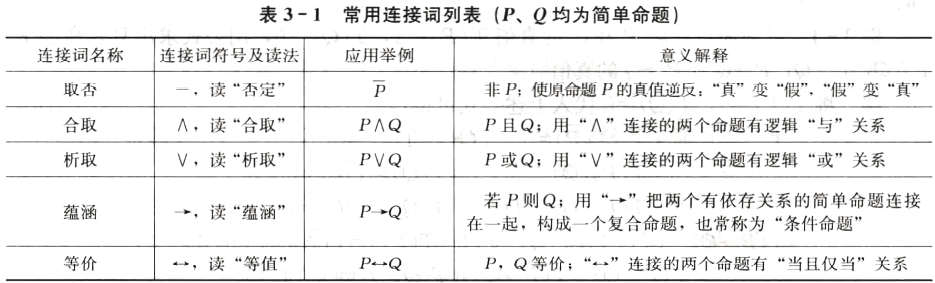
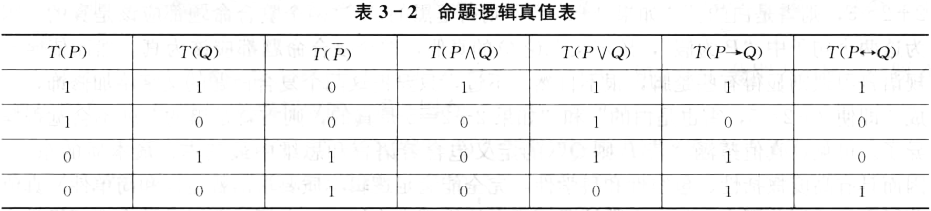
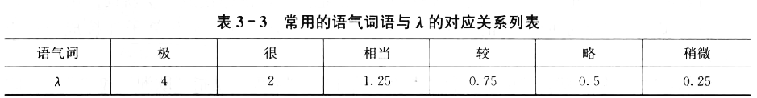
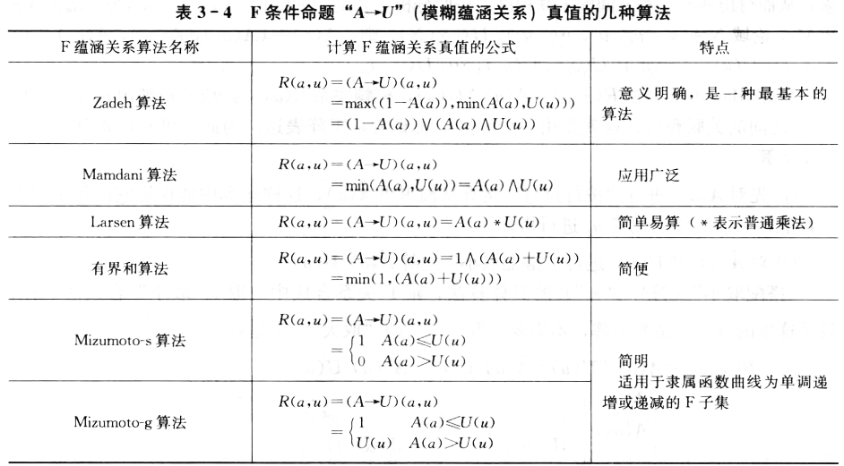
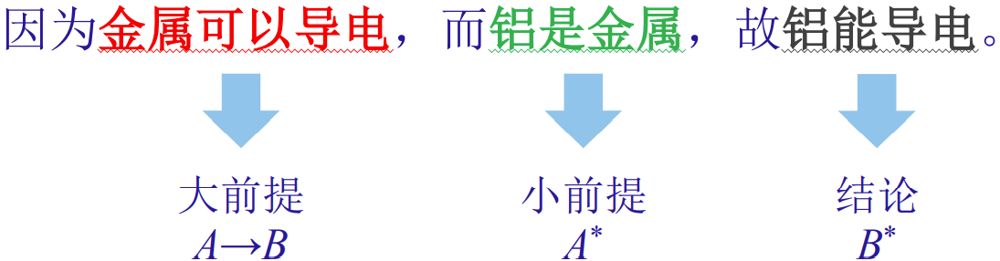
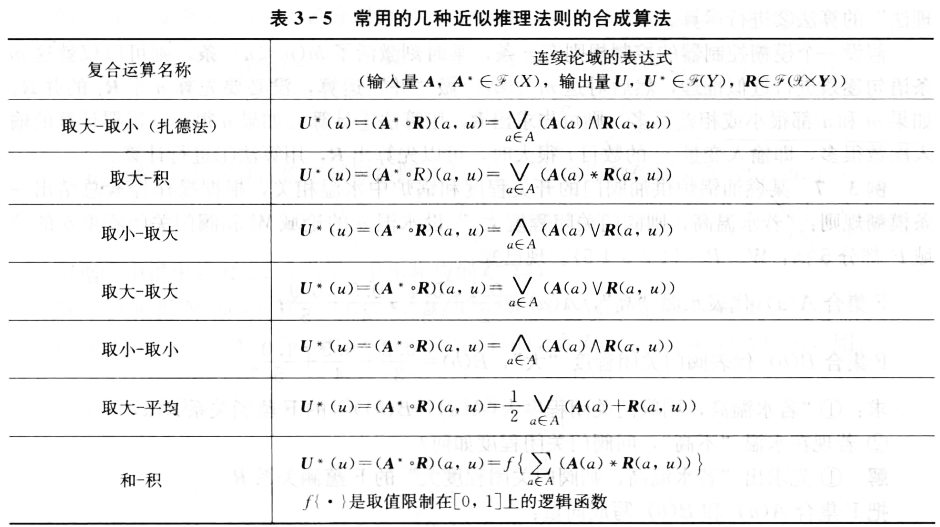

## 3.1 二值逻辑简介

### 3.1.1 判断

#### 1. $语句 \supset 命题 \supset 判断$
- 语句：语言的基本单位，是由词语或词组按照一定语法规则构成的，包括陈述句、疑问句、祈使句和感叹句等，语句种类视具体语言而定。
- 命题：反应事物情况的思维形态的语句，一定是陈述句。它反映了事物的属性、所处状况以及和其他事物之间的联系。
- 判断：能够被断定者断定真假的命题称为判断，如果一个命题无法确定其真假，则不能成为一个判断。

#### 2. 命题连接词及复合命题




命题逻辑的真值的数学表示
$$
\begin{array}{c}
T(\bar{P})=1-T(P) \\
T(P \wedge Q)=\min (T(P), T(Q))=T(P) \wedge T(Q) \\
T(P \vee Q)=\max (T(P), T(Q))=T(P) \vee T(Q) \\
T(P \rightarrow Q)=(T(P) \wedge T(Q)) \vee T(\bar{P})=(T(P) \wedge T(Q)) \vee(1-T(P)) \\
T(P \leftrightarrow Q)=T(P \rightarrow Q) \wedge T(Q \rightarrow P)
\end{array}
$$

#### 3. 条件命题
：两个简单命题P和Q经蕴涵连接词构成的复合命题 $P \rightarrow Q$.

当P为真时，条件命题真假性由Q决定；当P为假时，条件命题恒为真。

条件命题中，P和Q可能没有事实上的联系，但将两者相连时，“蕴含”就不仅仅是通过日常的逻辑进行推断，而是从理念上经过千丝万缕连结的结果。
这种连结可能是逻辑上直接的联系，也有可能是表面毫无关联的两个事物。但即使没有关联，也总会在某一个情境下出现。

条件命题除了可以表示真实的条件关系以外，还可以表示让步、虚拟假设、演绎推理等很多关系，在自然语言中可以找到很对与之对应的说法。

从数学的角度讲，将上述规则加以抽象并统一加以归纳，就可以得到条件命题。这时候当P为真时，就可以推出同样为真的Q，但推不出为假的Q；而当P为假的时候，则无所谓Q的真假都可以推出。

#### 4. 两种常用条件命题的基本形式
假设A,B,C,U都表示简单命题，T(A)表示A的真值。

1、若A，则U：$A \rightarrow U$
$$
R=T(A \rightarrow U)=(1-T(A)) \vee(T(A) \wedge T(U))=T(\vec{A}) \vee(T(A) \wedge T(U)) \stackrel{0, 1}{=} T(\bar{A}) \vee T(U)
$$

2、若A且B，则U：$(A \wedge B) \rightarrow U$
$$
\begin{aligned}
R &=T((A \wedge B)>U) \\
&=(1-T(A \wedge B)) \vee(T(A) \wedge T(B) \wedge T(U)) \\
&=(1-(T(A) \wedge T(B))) \vee(T(A) \wedge T(B) \wedge T(U)) \\
&\stackrel{0, 1}{=}(T(\bar{A}) \vee T(\bar{B})) \vee(T(A) \wedge T(B) \wedge T(U))
\end{aligned}
$$

3、若 $A_1$ 且 $A_2$且...$A_n$，则U
$$
T\left(\left(A_{1} \wedge \ldots \wedge A_{n}\right) \rightarrow U\right)=T\left(\overline{A_{1}}\right) \vee \ldots \vee T\left(\overline{A_{n}}\right) \vee T(U)
$$

4、若A则 $U_1$，否则 $U_2$
$$
T\left(\left(A \rightarrow U_{1}\right) \vee\left(\bar{A} \rightarrow U_{2}\right)\right)=T\left(\left(\bar{A} \vee U_{1}\right) \vee\left(A \vee U_{2}\right)\right)
$$

5、若 $A_1$ 或 $A_2$或...$A_n$，则U
$$
T\left(\left(A_{1} \vee \ldots \vee A_{n}\right) \rightarrow U\right)=\left(T\left(\overline{A_{1}}\right) \wedge \ldots \wedge T\left(\overline{A_{n}}\right)\right) \vee T(U) =\left(T\left(\overline{A_{1}}\right) \vee T(U)\right) \wedge \ldots \wedge\left(T\left(\overline{A_{n}}\right) \vee T(U)\right)
$$

### 3.1.2 推理
由已知的一个或几个判断（命题），按一定法则得出一个新判断（命题）的思维过程和方式，是一种由已知条件求出未知结果的思维活动。


## 3.2 自然语言的模糊集合表示

### 3.2.1 一些自然词语的F集合表示
自然语言中凡事含有表数量、程度概念的词语描述，可以用模糊集合表示，以方便计算机利用数学的方法来处理自然语言。

### 3.2.2 模糊算子

#### 1. 否定修饰词（不是反义词）
在某些自然词语前面加上否定性修饰词，可以得到含有新意的自然词语，相当于表示原自然语言F集合的“非”。

#### 2. 连接词“或”“且”
自然语言中的“也”“且”“或”等连词，可以把两个词语连接成一个新词。
用F集合表示时，相当于把表示原词语的F集合，用并“$\cup$”、交“$\cap$”等F算子连接成新的F集合。

> “中老年”是“中年”和“老年”两个模糊集合的并集；“品学兼优”是“品德好”和“学习优秀”的交集。

#### 3. 语气算子
一些表示程度类自然语言前面加上“很”“极”“非常”“稍微”“特别”“比较”等形容词或副词，可以调整原来词义的肯定程度，使其语气发生变化，形成一个新词。

设表示原词语的F集合隶属函数为A(x)，则表示新词语的F集合隶属函数 $B(x)=A^{\lambda}(x)$，由于 $\lambda$ 的取值不同，则对原词意进行不同强度的调整，表示不同的修饰意义：
- 当 $\lambda<1$ 时，使原词义散漫化;
- 当 $\lambda>1$ 时，使原词义集中化。

常用的语气词语与 $\lambda$ 的对应关系列表（主观）



## 3.3 模糊逻辑和近似推理

### 3.3.1 模糊命题

#### 1. 简单模糊命题及其真值的表示方法
如果一个命题中的真值取值范围由 $\{0, 1\}$ 扩展到 $[0, 1]$，那么这个命题就是一个模糊命题。
一般用小写字母表示命题中的主项变量，对应大写字母表示命题本身的描述。

#### 2. 复合模糊命题及其真值
跟二值逻辑一样，用五种连接词构成复合模糊命题

### 3.3.2 常用的两种基本模糊条件语句
假设 $A(a), B(b), U(u)$ 均为F命题

#### 1. 若A，则U（$A \rightarrow U$）（若a是A，则b是B）
其真值可以表示为 $R(a, b) = A(a) \rightarrow B(b)$，是一个二元函数，反映了由A到B的一种变化，被称作模糊蕴涵关系。


**Mamdani算法详解**
Zadeh算法中共有两项相取大。当A(a)值很小时，1-A(a)这一项在公式中占主导地位；而A(a)值很小又意味着A→B成立的基础非常薄弱，整个条件命题就会没有太多的意义。
因此往往忽略1-A(a)这一项，得到应用广泛的Mamdani算法。
$R(a, u) = (A \rightarrow U)(a, u) = A(a) \wedge U(u)$

A对应论域里的每一个元素都要和B对应论域中的每一个元素进行取小操作，因此实际上需要计算一个关系矩阵R(a, b)，这就需要利用两个模糊集合的二元模糊关系矩阵的求法。

具体操作时，将A变为列向量，B变为行向量，然后进行合成即可得到模糊蕴涵关系矩阵R：
$R = \vec{A} \circ B$

三个步骤：① 向量化（注意补出缺项）；② 拉成一列；③ 合成运算（每列做数积）。

#### 2. 若A且B，则U
#### 3. 若A则 $U_1$，否则 $U_2$

### 3.3.3 近似推理及其合成法则

#### 1. 模糊逻辑推理（近似推理）
经典推理一般采用一种逻辑演绎的方法来进行的，可以俗称“三段论”
它由大前提、小前提和结论三部分构成，每一部分都是一个可以确定真假的命题。


模糊推理也般采用“三段论”。如以下模糊推理：
（设a：西红柿的颜色；u：西红柿的成熟度；A：红；U：熟；$A^{*}$：有点红；$U^{*}$：有点熟。
- 大前提：$A(a) \rightarrow U(u)$
- 小前提：$A^{*}(a)$
- 结论：$U^{*}(u)$

#### 2. 模糊逻辑推理的合成法则
**Mamdani-Zadeh模糊推理公式**
已知 $A(a) \rightarrow B(b)$，若有 $A^{*}(a)$，则求对应的 $B^{*}(b)$ 可以利用Zadeh给出的算法。
$B^{*}(b)=A^{*}(a) \circ R(a, b)$

R(a, b) 是由大前提给出的，代入Mamdani算法即可 得出Mamdani-Zadeh模糊推理公式：
$B^{*}(b)=A^{*}(a) \circ R(a, b)=A^{*}(a) \circ(\overrightarrow{A}(a) \circ B(b))$

**模糊推理的简便运算**
$B^{*}$ 实际上是三项内容的结合运算。根据合成运算的结合律：
$B^{*}=A^{*} \circ R=A^{*} \circ(\overrightarrow{A} \circ B) =\left(A^{*} \circ \vec{A}\right) \circ B=\lambda \wedge B$
1. $\lambda$ 即 $A^{*}, \vec{A}$ 中对应元素取小再取大，$F = \min(A^{*}, A), \lambda = F_{max}$
2. $B^{*}$ 是B和 $\lambda$ 的数积

#### 3. 合成法则的具体算法



---
### 复合Mamdani算法
考虑复合命题 “若 A(a) 且 B(b)，则 C(c) ”，数学表达：“$A \wedge B \rightarrow C$”。
对应Mamdani公式：$R(a, b, c)=(A \wedge B \rightarrow C)(a, b, c)=A(a) \wedge B(b) \wedge C(c)$

具体使用合成运算步骤：
$$
R(a, b, c)=A(a) \wedge B(b) \wedge C(c)=(\overrightarrow{\vec{A}(a) \circ B(b)}) \circ C(c)=\overrightarrow{D}(a, b) \circ C(c)
$$
1. 先求出中间矩阵D。
2. 将矩阵D按行拉成一列，和C求合成。

### 第Ⅰ类复合M-Z推理法则
已知 $A(a) \wedge B(b) \rightarrow C(c)$，若有 $A^{*}(a) \wedge B^{*}(b)$，则求对应 $C^{*}(c)$ 可以按照复合MZ法则如下：
$$
\begin{aligned}
C^{*}&=\left(A^{*} \wedge B^{*}\right) \circ R=\left(\overrightarrow{\overrightarrow{A}^{*} \circ B^{*}}\right)^{\mathrm{T}} \circ R \\
&=\left(\overrightarrow{\overrightarrow{A}^{*} \circ B^{*}}\right)^{\mathrm{T}} \circ(\overrightarrow{\overrightarrow{A} \circ B}) \circ C=\left(\overrightarrow{D}^{*}\right)^{\mathrm{T}} \circ \overrightarrow{D} \circ C \\
&=\left(\left(\overrightarrow{D}^{*}\right)^{\mathrm{T}} \circ \overrightarrow{D}\right) \circ C=\lambda \wedge C
\end{aligned}
$$

$\lambda$ 的简便求法：
将 $(\overrightarrow{D}^{*})^{\mathrm{T}}$ 与 $\overrightarrow{D}$ 进行合成运算得到 $\lambda$ ，可以看出是角标相同的元素之间先取小，最后统一取大。
而角标就是该元素在矩阵中的位置。
$$
\begin{aligned}
\lambda&=\left(\overrightarrow{D}^{*}\right)^{\mathrm{T}} \circ \overrightarrow{D}=\left(x_{11} \wedge y_{11}, \cdots, x_{m n} \wedge y_{m n}\right)_{\max } \\
&=\left[\begin{array}{ccc}
x_{11} \wedge y_{11} & \cdots & x_{1 n} \wedge y_{1 n} \\
\cdots & \cdots & \cdots \\
x_{m 1} \wedge y_{m 1} & \cdots & x_{m n} \wedge y_{m n}
\end{array}\right]_{\max } \\
&=\left(\min \left(D^{*}, D\right)\right)_{\max }=(F)_{\max }
\end{aligned}
$$

综上，第Ⅰ类复合M-Z推理步骤如下：
1. $D =\vec{A} \circ B$
2. $D^{*}=\vec{A}^{*} \circ B^{*}$
3. $F=\min \left(D^{*}, D\right) \quad \lambda=F_{\max }$
4. $C^{*}=\lambda \wedge C$

第I类复合MZ推理子程序
```m
function c=MultiMZ_inference1(A,B,C,a,b)
    A=A'; a=a';
    D=syn(A,B); d=syn(a,b);
    lambda=max(max(min(D,d)));
    c=min(lambda,C);
end
```

### 第Ⅱ类复合M-Z推理法则
已知若 $A_1$ 则 $B_1$ ，若 $A_2$ 则 $B_2$ ；现有 $A^{*}$ ，求 $B^{*}$ 。这样的大前提其实是 $A_1 \rightarrow B_1$ 和 $A_2 \rightarrow B_2$ 的并。
所以其结果也是两者的并。因此先求出 $B_1^{*}$ 和 $B_2^{*}$ 这两个分项结果，然后取并集。
$$
\begin{aligned}
B^{*}&=B_{1}^{*} \cup B_{2}^{*} \\
&=\left(\left(\min \left(A_{1}, A^{*}\right)\right)_{\max } \circ B_{1}\right) \cup\left(\left(\min \left(A_{2}, A^{*}\right)\right)_{\max } \circ B_{2}\right) \\
&=\left(\left(F_{1}\right)_{\max } \circ B_{1}\right) \cup\left(\left(F_{2}\right)_{\max } \circ B_{2}\right) \\
&=\left(\lambda_{1} \wedge B_{1}\right) \cup\left(\lambda_{2} \wedge B_{2}\right)
\end{aligned}
$$

综上，第Ⅱ类复合M-Z推理步骤如下：
1. $F_{1}=\min \left(A_{1}, A^{*}\right) \quad \lambda_{1}=\left(F_{1}\right)_{\max }$
2. $F_{2}=\min \left(A_{2}, A^{*}\right) \quad \lambda_{2}=\left(F_{2}\right)_{\max }$
3. $B_{1}^{*}=\lambda_{1} \wedge B_{1} \quad B_{2}^{*}=\lambda_{2} \wedge B_{2}$
4. $B^{*}=B_{1} \cup B_{2}$

